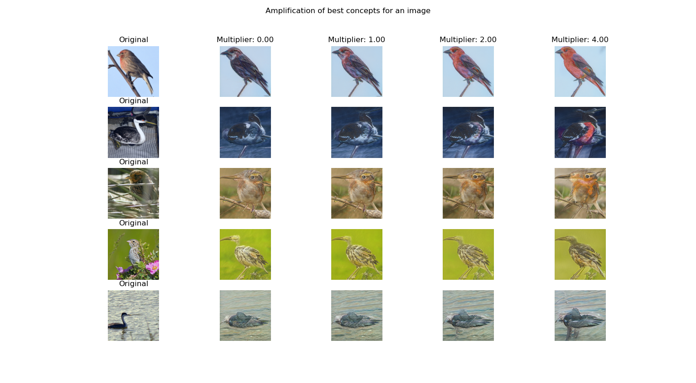
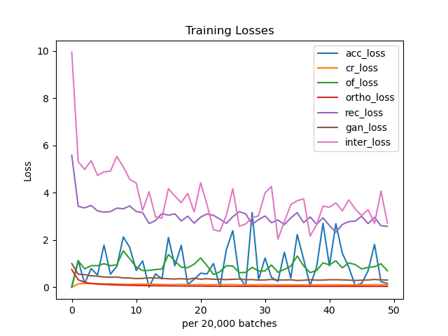
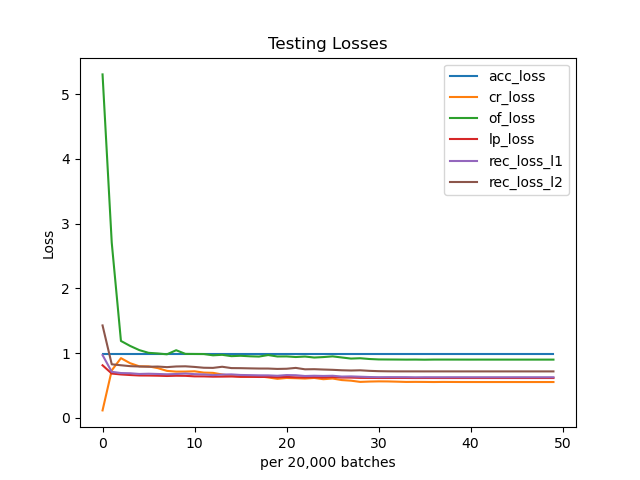
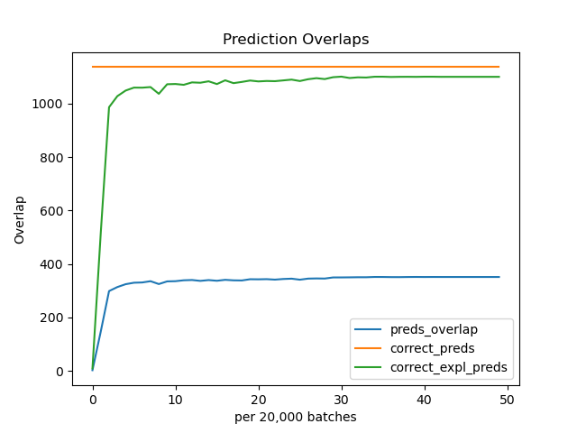
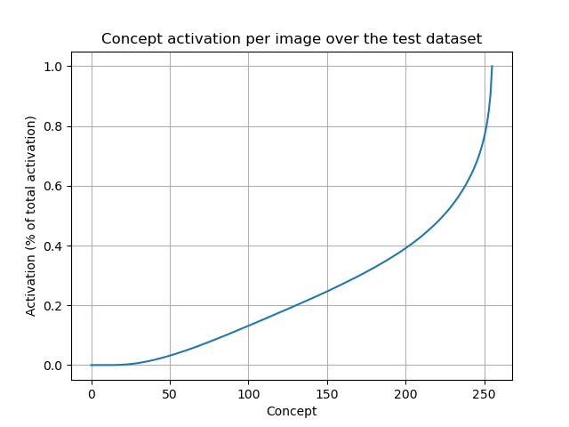
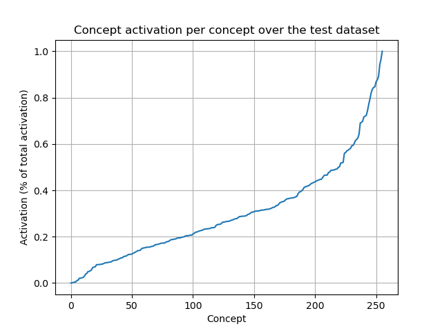
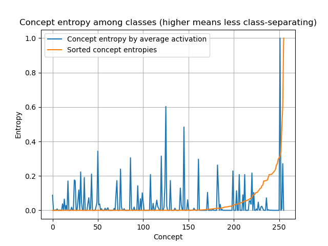
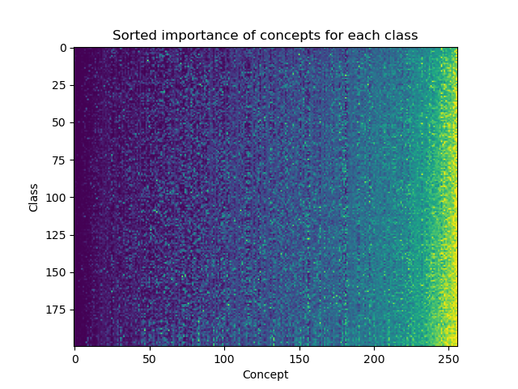
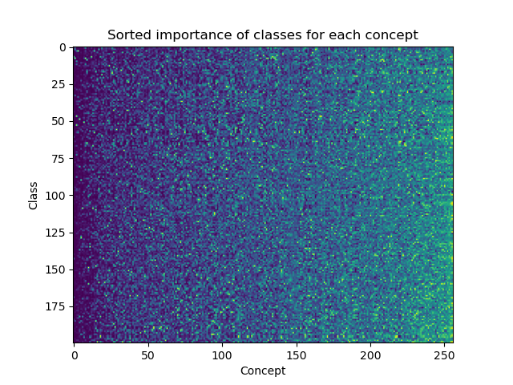
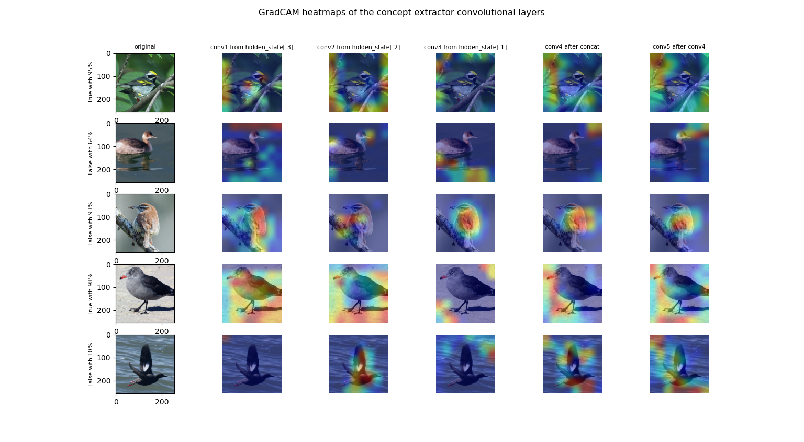

# VisCoIN

<div align="center">
  
  
  
</div>

<br>

Implementation of Vision Concept-based Interpretable Networks. [See the paper](https://arxiv.org/abs/2407.01331v1).

This project uses the [Black](https://github.com/psf/black) python formatter. Imports are sorted using [isort](https://pycqa.github.io/isort/).

Datasets will be downloaded automatically. Change the `KAGGLEHUB_CACHE` environment variable to specify where to download the datasets. Custom-downloaded datasets are stored under the name `viscoin`.

See also (used in this repository):

- [StyleGAN2 ADA](https://github.com/NVlabs/stylegan2-ada-pytorch)
- [CLIP](https://github.com/openai/CLIP)



## Project Structure

Structure of the `viscoin` folder.

```bash
├── ../stylegan2_ada  # Pytorch implementation of StyleGAN2 ADA
│
├── cli            # Command line functions
│
├── datasets       # Pytorch dataloaders for every dataset
│   ├── cub                 # CUB dataset loader
│   └── transforms          # Standard dataset preprocessing transformations
│
├── models         # Model definitions
│   ├── classifiers         # Classifier model (`f`)
│   ├── concept_extractors  # From classifier latent to concepts (`Psi` in VisCoIN)
│   ├── explainers          # From concepts to class (`Theta` in VisCoIN)
│   └── gan                 # StyleGAN implementation (modified stylegan2_ada)
│
├── testing        # Testing functions
│   ├── classifiers         # Testing function for the classifier
│   └── viscoin             # Testing functions for the viscoin ensemble
│
└── training       # Training functions
    ├── classifiers         # Training function for the classifier
    ├── losses              # Loss functions
    ├── utils               # Training utilities
    └── viscoin             # Training function for the viscoin ensemble
```

## Quickstart

If you are a nix user, skip the `conda` part and run `nix develop`.
Create a conda environment for the project with these commands:

```bash
conda env create -f conda.yml  # Create the `viscoin` environment
conda activate viscoin         # Activate it
```

If you encounter an issue, you might have to run the following commands, depending on your conda implementation:

```bash
conda config --set channel_priority flexible
micromamba config set channel_priority flexible
```

Clone the StyleGAN2 ADA submodule:

```bash
git submodule update --init
```

The StyleGAN uses a custom CUDA plugin. You need to install a CUDA compiler (`nvcc`), and export the `CUDA_HOME` environment variable.

Last, the example script:

```bash
python example.py
```

## CLI Commands

The following cli commands are available:

| Command            | Description                                                              |
| ------------------ | ------------------------------------------------------------------------ |
| `train`            | Train the classifier model or the VisCoIN ensemble                       |
| `test`             | Test the classifier model or the VisCoIN ensemble                        |
| `logs`             | Parse the VisCoIN training logs and plot losses & metrics                |
| `to-pickle`        | Convert VisCoIN safetensors with defaults args to an easy to load pickle |
| `concepts`         | Analyze the VisCoIN distribution of concepts                             |
| `amplify`          | Amplify image concepts                                                   |
| `concept-heatmaps` | Display concept heatmaps (WIP)                                           |

Be sure to have downloaded the dataset, and to have checkpoints for the viscoin ensemble.

### Train

Train the classifier:

```bash
# For CUB
python main.py train classifier --epochs 30 --learning-rate 0.0001  --dataset cub
```

Train the VisCoIN ensemble:

```bash
# For CUB
python main.py train viscoin --batch-size 8 --dataset cub
```

### Test

Test the classifier:

```bash
python main.py test classifier --dataset cub --checkpoints checkpoints/cub/classifier-cub.pt
```

### Logs

Inspect VisCoIN training logs:

```bash
python main.py logs --logs-path viscoin_30.log
```





### To Pickle

Convert VisCoIN safetensors after training to a pickle file:

```bash
python main.py to-pickle --checkpoints viscoin4-5.pth --output viscoin-cub.pkl
```

### Concepts Analytics

Analyse VisCoIN concepts:

```bash
python main.py concepts --dataset cub --viscoin-pickle-path viscoin-cub.pkl
```

Note that the results are cached. Use `--force` to recompute them.







### Amplifying concepts

Amplifying concepts whose activation is over a threshold:

```bash
python main.py amplify --viscoin-pickle-path checkpoints/cub/viscoin-cub.pkl --concept-threshold 0.2
```

Amplifying the top k concepts for each image:

```bash
python main.py amplify --viscoin-pickle-path checkpoints/cub/viscoin-cub.pkl --concept-top-k 5
```


### Concept Heatmaps

> ![WARNING]
> WIP

Visualize concept heatmaps:

```bash
python main.py concept-heatmaps --dataset cub --viscoin-pickle-path viscoin-cub.pkl
```



## Hyperparameters

### Models

Hyperparameters used on different datasets for the training of the different VisCoIN models.

### Classifier

| Dataset       | Optimizer | Learning Rate              | Epochs |
| ------------- | --------- | -------------------------- | ------ |
| CUB           | Adam      | 0.0001                     | 30     |
| CelebA-HQ     | Adam      | 0.001                      | 10     |
| Stanford-Cars | SGD       | 0.1 (x0.1 every 30 epochs) | 90     |

### GAN

The GAN is pretrained. Model instance parameters:

For the original stylegan which we have pretrained weights for:

```python
generator = Generator(
    z_dim=512,
    c_dim=0,
    w_dim=512,
    img_resolution=256,
    img_channels=3,
    mapping_kwargs={
        "num_layers": 2,
        "w_avg_beta": 0.995,
    }
)
```

For the adapted VisCoIN GAN:

```python
generator = GeneratorAdapted(
    z_dim=256,  # concepts
    c_dim=0,  # no conditionning label
    w_dim=512,  # intermediate latent dimensionality
    img_resolution=256,  # image size
    img_channels=3,  # RGB
    mapping_kwargs={
        "num_layers": 1,
        "fixed_w_avg": None,
        "coarse_layer": 2,
        "mid_layer": 10,
    },
)
```

### VisCoIN

For all datasets and all subnetworks:

| Optimizer | Learning Rate | Epochs                         | Batch Size                        |
| --------- | ------------- | ------------------------------ | --------------------------------- |
| Adam      | 0.0001        | 100,000 (50,000 for CelebA-HQ) | 16 (8 original + 8 gan generated) |

## Running jobs with SLURM

There are 2 ways to run jobs on a server that allocates GPUs using SLURM.

Run `sinfo` to see a list of available partitions.

### Interactive

You can run scripts interactively in the terminal with `srun`:

```bash
srun --gpus=1 --partition=P100 --pty bash  # Open a shell on a GPU node
srun --gpus=1 --partition=P100 nvidia-smi  # Display the GPU capabilities of a node

# Run a full job interactively
srun --gpus=1 --partition=P100 --time=00:10:00 --nodes=1 --gpus=1 python main.py test classifier --dataset-path datasets/CUB_200_2011/ --batch-size 512
```

### Background

In order to run jobs in the background, you have to define bash scripts. Jobs running in the background will write their output to a `slurm-<job-id>.out` file.

Example script:

```bash
/usr/bin/env bash

# Partition for the job:
#SBATCH --partition=P100

# Multithreaded (SMP) job: must run on one node
#SBATCH --nodes=1

# Maximum number of GPUS used by the job:
#SBATCH --gpus=1

# The maximum running time of the job in days-hours:mins:sec (here: 1h)
#SBATCH --time=0-01:00:00

srun python main.py test classifier --dataset-path datasets/CUB_200_2011/ --batch-size 512
```

You then have to run the script (and interact with it) using these commands:

```bash
sbatch my-script.bash  # Launch the background job
squeue -j <job-id>  # See whether the job it still running
```

You can monitor the output using the following command:

```bash
# You could also use `watch -n 10`, but it has an issue with progress bars
while true; do clear && cat slurm-<job-id>.out; sleep 10; done
```
